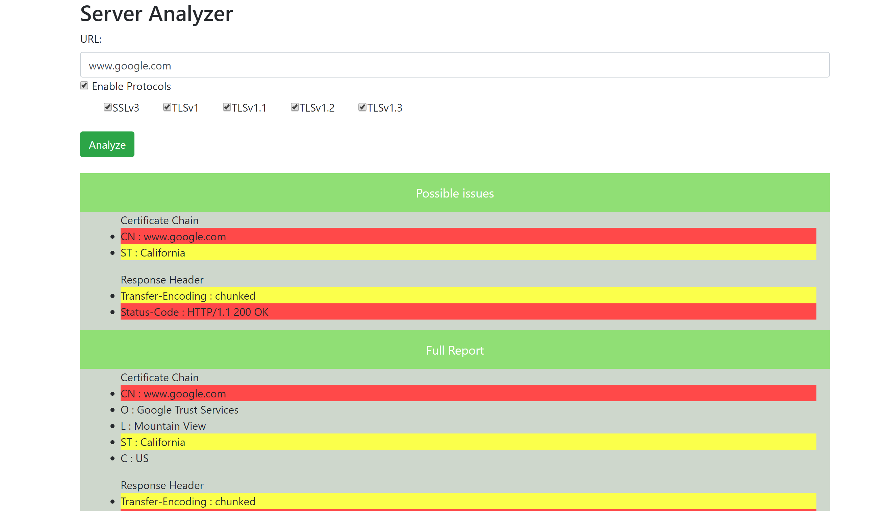

# Server Analyzer

Web Application Configuration Vulnerability Analyzer
Written using springboot, maven and java.

## Description
Given a host and port, this application gathers the following information about the server: 
Available protocols. (eg. SSL3, TLS 1.1, TLS 1.2)
Available ssl ciphers.
Hosted certificate. (Including chain)
Response headers.

A report is generated on the front end that shows security vulnerabilities.
The user is able to save the information as a pdf.
To check for certain vulnerabilities there is a configuration file that the user will need to use to flag certain information. 

